# Domain-Adaptive LLM Fine-Tuning for Enterprise Policy QA

A production-grade domain-adaptive fine-tuning pipeline that specializes a pretrained Llama-3.2-1B model for enterprise HR Leave & Benefits policy reasoning, using synthetic instruction generation, quality gating, and LoRA-based PEFT training — without retrieval at inference time.

This project demonstrates how small, high-quality policy data can meaningfully alter LLM behavior, improving factual grounding and hallucination control for compliance-sensitive domains.

## 🚀 What This Project Does

- 📄 **Parses enterprise policy PDFs** into structured, context-aware chunks
- 🧠 **Generates synthetic instruction–response pairs** using strict policy-grounded prompts
- 🧹  **Filters low-quality supervision** via heuristic + LLM-based quality gating
- 🧪  **Fine-tunes a pretrained LLM** using **LoRA (PEFT) + 4-bit quantization**
- ⚖️ **Trains hallucination-aware behavior**, enforcing “Not specified in the provided excerpt”
- 🔍 **Evaluates behavioral divergence** vs. the base model through A/B testing
- 🧩 **Deploys adapters locally** using Ollama for reproducible inference

---
## 💡 Why This Matters

- Enterprise policies require precision, not creativity
- Base LLMs hallucinate plausible but incorrect policy details
- RAG alone does not fix behavioral priors
- This project shows how fine-tuning reshapes next-token probabilities so the model:
   - answers only what is stated
   - refuses confidently when information is missing
   - internalizes policy structure instead of retrieving it at runtime
- This pattern generalizes to:
   - HR & benefits
   - Legal & compliance
   - Internal SOPs
   - Financial / regulatory documents
---
📄 Data & Document Policy

> ⚠️ Note: This repository does not include source documents or generated training artifacts.  
> Users are expected to supply their own documents and reproduce the pipeline locally or in cloud environments.

---
## 🏗️ Architecture Diagram

**Important distinction**

- Training time → document → data → weights
- Inference time → no retrieval, no vector store

```mermaid
flowchart LR
    PDF["📄 Policy PDF"]

    subgraph Data["📦 Data Generation"]
        Parse["🔎 Parse + Chunk<br/>(Docling)"]
        Context["🧠 Contextualize Chunks"]
        Synth["✍️ Synthetic Q/A Generation<br/>(Policy-Constrained Prompt)"]
        Pre["🧹 Preprocessing"]
        Quality["⚖️ Data Quality Gating<br/>(Heuristics + LLM Judge)"]
    end

    subgraph Train["🧠 Model Training"]
        Base["🤖 Base LLM<br/>(Llama-3.2-1B)"]
        LoRA["🧩 LoRA PEFT<br/>(r=256, α=512)"]
        SFT["🔥 Supervised Fine-Tuning"]
    end

    subgraph Deploy["🚀 Deployment"]
        Adapter["📦 LoRA Adapter"]
        Ollama["🖥️ Ollama Runtime"]
    end

    PDF --> Parse --> Context --> Synth --> Pre --> Quality
    Quality -->|"124 high-quality samples"| SFT
    Base --> SFT --> LoRA --> Adapter --> Ollama
```
  

---
## 🏗️ Execution Sequence (End-to-End)


---

## 📁 Project Structure
```text
domain_adaptive_llm_finetuning/
├── data/
│   ├── instructionquality.json           # Filtered training dataset
│   
│
├── checkpoints/
│   ├── model.safetensors                 # Trained LoRA adapter
│   └── adapter_config.json
│
├── syntheticdatageneration.py            # Policy-constrained instruction generation
├── preprocessing.py                      # Flatten + normalize instructions
├── dataquality.py                        # Production-grade data quality gate
├── train.py                              # PEFT fine-tuning script
│
├── generated_prompt.py                   # Instruction synthesis prompt
├── Modelfile                             # Ollama adapter deployment config
│
├── pyproject.toml                        # uv dependency config
├── uv.lock                               # Fully reproducible lockfile
├── README.md                             # This file
```
---
## 🔄 End-to-End Pipeline (From PDF to Specialized Model)

---

### 1️⃣ Synthetic Data Generation

1. Parses a ***27-page HR policy PDF****
2. Uses **prompt constraints** to enforce:
     - no external knowledge
     - explicit uncertainty handling
     - numeric / system-specific questions
3. Produces 356 instruction–response pairs

---

### 2️⃣ Data Quality Gating

1. A production-grade filter, not a naive scorer.
2. Fast heuristics preserve:
     - short factual answers (e.g., “CAPPS”, “15 minutes”)
     - correct “Not specified” responses
3. LLM judge removes:
     - unrelated answers
     - malformed questions
     - weak supervision
4. Retains 240 high-quality samples (~37% reduction)

---

### 3️⃣ Fine-Tuning (PEFT)

1. Base model: Llama-3.2-1B
2. Method: LoRA PEFT
     - rank = 64
     - alpha = 128
3. Precision: 4-bit quantization
5. Memory footprint: <2 GB GPU
6. Result: Behavioral specialization, not memorization

---

### 4️⃣ Evaluation

1. Side-by-side testing against base model
2. Verified:
     - reduced hallucinations
     - correct refusal behavior
     - higher precision on policy-specific questions
3. Demonstrated clear divergence in next-token distributions

---

### 5️⃣ Deployment

1. Exported LoRA adapter only (no full weights)
2. Deployed locally using Ollama
3. Runtime artifact: ~1.4 GB
4. Enables:
     - fast iteration
     - eproducible testing
     - base vs fine-tuned comparison

---

## 🛠️ Prerequisites

### Local Development
- **Python 3.11+**
- **[`uv`](https://github.com/astral-sh/uv)** – fast Python package & environment manager
- **Git**
- **Ollama (for local inference)**
  
### Training (Optional GPU)
- **RunPod / similar GPU VM**
- **CUDA-compatible GPU**
- **Hugging Face access (for base model)**

---
## ⚙️ Setup Instructions

### 1️⃣ Clone the repository

```bash
git clone https://github.com/your-username/domain_adaptive_llm_finetuning.git
cd domain_adaptive_llm_finetuning

uv venv
source .venv/bin/activate
uv sync
```

### 2️⃣ Generate Data

```bash
uv run python syntheticdatageneration.py
uv run python preprocessing.py
uv run python dataquality.py
```


### 3️⃣ Train

```bash
uv run python train.py
```
### 4️⃣ Deploy Adapter Locally

```bash
ollama create llama_tuned -f Modelfile
ollama run llama_tuned
```


